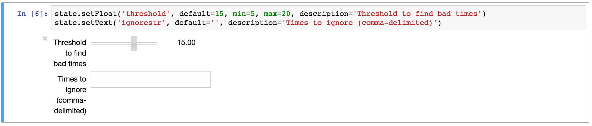

# nbpipeline: Stateful notebooks with interaction

## Intro
Jupyter notebooks are a good way to document output from pipeline data analysis, where the notebook can produce products or be a data product itself. In my experience with pipelines, there are 10% of cases (say a batch of data) is anomalous and needs further investigation. I found myself asking: How can one enable my collaboration to participate in the refinement of the analysis pipeline?

`nbpipeline` is designed to allow groups to interact with notebooks while maintaining state between different (Python) kernel sessions. Multiple users may execute the notebook, modify pipeline parameters via the widgets, and update visualizations. State is saved in a directory on the file system. They can be saved in either text of pickle format.

## Using
To use this, create a "base" notebook that functions like a pipeline script. Visualizations may be embedded, if one wishes the notebook to be a documented pipeline work flow or the notebook may produce secondary products outside the notebook. The base notebook can use the `nbpipeline` state object to create widgets as input to the pipeline and save their state. Instantiate the state as in this (pre-defined) example:

    > state = nbpipeline.state('notebook.ipynb-state')
    > state.objects
    ['ignorestr', 'threshold']

Widgets are available for interactive input without needing to know the pipeline syntax. Default values are defined for all widgets, so the notebook can also be executed with nbconvert into ipynb or html or other formats.

## Goals
- allow nbconvert to compile a notebook.
- provides for interaction by multiple users after notebook has been compiled.
- use widgets as a simple way for people unfamiliar with Jupyter to update pipeline parameters.
- provides a simple example script to compile a base notebook and convert it to html.
